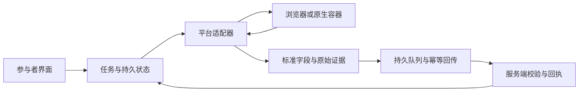

# 众包采集的持续改造边界

2026-10-09。用户目标：保留 Kimi 已有的实用功能，优化实现并增加能力，使整套采集系统可以提高有效采集能力、复用到其他平台。Kimi 3.4.14 是行为对照基线，不是逐行复刻目标。不得以重构为由静默删除用户功能，也不得把接口抽象等同于已接入新平台。

## 功能对照与当前改动

| 用户能力 | Kimi 基线 | v4 当前实现与变化 |
|---|---|---|
| 静默采集 | 后台 inactive 标签，无须一直打开 popup | 保留；4.2.1 恢复直接创建目标 URL，4.2.2 在任务完成后关闭工作页。真实安装 Chrome 关闭面板后完成两条隔离测试记录，前台标签不变 |
| 停止新采集，继续回传已取得记录 | CROWD_STOP 保留 upload_retry | 4.2.2 恢复独立回传闹钟；退出身份则停止回传。断网退避和原请求 UUID 跨 worker 恢复 |
| 自动领任务、轮换关键词、查看进度 | 关键词包和逐词计数 | v4 采用服务端租约任务；4.2.2 增加逐任务总进度与本人进度。原关键词包编组展示尚未搬入，单任务目标及轮换行为保留 |
| 搜索、预去重、详情采集 | 预过滤已知 ID，最多取 12 张卡片 | 服务端已知记录、本人历史及本次已见记录先过滤；候选上限 80。4.2.2 找到足够未见候选即进入详情，避免两条测试任务固定再滚两轮 |
| 离线队列、失败证据、幂等回执 | envelope UUID、retry、deadletter | 保留并加强：未知回执不删证据；失败记录可导出；积累过多则暂停；收到回执与通过核验分开 |
| 人工评价 | 自愿 1–5 分、理由、关联本人笔记 | 4.2.2 补回界面、离线队列及服务端 RPC。只能关联本人已接收且未拒绝的笔记，每人每任务一次；不自动评价、不改变证据奖励 |
| 重启、休眠、异常恢复 | alarms、init 恢复、watchdog | 持久阶段与单写入者；重启不复活停止任务、不跳过既存等待；页面和回执故障分别处理 |
| 风险与调度 | 昼夜曲线、设备预热、session、远程配置 | v4 服务端统一访问间隔、每日预算、会话休息、限流/验证码暂停。Kimi 随机画像/昼夜权重不逐项复制；调度效果及用户可控时段待按需求验证，不能称为完全等价 |
| 更新与诊断 | 原版更新渠道和状态展示 | Mac 原位签名更新、失败回退、用户可关闭的有限诊断。不会远程执行任意脚本；原设备是否加载新版本单独验收 |
| 评论、作者等增强采集 | 原基线以搜索卡片为主 | v4 已有正文证据、可见评论、作者资料的独立观察回执和预算；覆盖有限就明确记录，不以空值或摘要伪装全文 |
| 多浏览器/容器 | Chrome / Firefox 源码 | 保留已有原生桥与 Firefox 源码测试；本轮实机是 Apple 芯片 Mac Chrome。Firefox、Windows、Android、Intel 的新功能与更新体验尚未实机验收 |

基线文件是 Kimi 任务目录的 `crowd_extension/src/background_v3414.js`，导航证据详见 [KIMI_NAVIGATION_BASELINE.md](KIMI_NAVIGATION_BASELINE.md)。未在这份 3.4.14 扩展基线中找到微信采集代码；其他项目或服务端的微信表不能冒充已接入的客户端功能。

## 代码边界

- `core.js`：共享证据和回执合同；`platform(id)` / `taskPlatform(task)` 提供已打包的平台 URL、身份和能力合同。目前只注册小红书。老任务缺少 platform 时按原协议解释；明确传入未知平台就暂停，不能误导航到小红书。
- `agent.js`：持久任务、预算准入、断点恢复、队列投递；搜索地址及笔记/作者身份改为调用适配合同。取得记录后与采集等待解耦，用户停止新采集仍可回传已有证据。
- `content.js`：目前的小红书页面适配器，页面选择器、可见内容、验证门和页面提取全部留在这里，对外提供 `CrowdPage.probe(action)`。不把新平台选择器混进调度状态机。
- `background.js` / `native-runtime.js`：容器能力。标签页和消息运输与内容提取分开；现有容器的权限和原生接口仍有小红书限制，不能据此声称任意平台已可运行。
- 服务端：身份、任务租约、全局去重、准入预算、数据验证和回执的权威来源。人工评价与客观证据分账。

这些是第一步解耦，不是完成的多平台框架。当前服务端记录校验和部分去重仍限制小红书，浏览器导航监听/manifest 也只允许已有平台。

## 下一平台接入的必要交付

1. 选择一个真实目标平台及采集范围，建立搜索、内容、登录/验证码、空结果和布局变化的固定页面样本。
2. 添加平台适配器和能力声明；不支持评论或作者资料就显式跳过，不制造空成功。
3. 服务端任务增加显式平台、内容类型和适配版本；记录身份、历史去重、预约及唯一键统一为平台加内容 ID。迁移旧小红书 ID，不混淆旧队列或回执。
4. 扩展匹配域名、导航监听、原生容器允许列表和权限随发行版本一起变更。现有更新助手会拒绝权限扩张；新平台安装授权需作为正式渠道升级处理，不能通过远程配置绕开。
5. 同一组生命周期测试覆盖两个平台：静默运行、停止、休眠恢复、离线重试、幂等入库、坏版本回退；各平台另测页面合同与真实性。只有真实任务形成服务端回执后才称为接入。

性能以有效记录率、每条有效记录的页面访问次数、失败/重试次数、回执延迟和恢复成功率衡量。优先减少重复搜索与重复详情、先回传正文再补充观察、按目标停止无效翻页；并发或访问频率提升必须用真实结果证明，不能仅看计数增加。

## 4.2.2 验证边界

- 本机 Darwin，隔离真实安装 Chrome：面板关闭后两条测试笔记完成、前台标签不变、任务结束工作页关闭、人工评分界面可提交；页面和回执是隔离 fixture，正式数据无新增。
- 本地数据库：评分关联/身份隔离/重复请求/无效评分/奖励不变通过。服务端迁移 `20261008170819_crowd_v4_ratings` 已部署；匿名执行和直接读评分表被拒绝，RLS 开启。
- 最终包签名原位更新：真实 Chrome 4.2.1→4.2.2 加载、身份/证据/用户标签保留、浏览器不重启，以及坏代码测试版回退全部通过；更新通道序号 `2026100903`，分发提交 `ead3339`。
- 2026-10-09 01:08 服务端只读核对：原参与设备仍为 4.2.0、停止、旧 `navigation_uncommitted`，正式接收 0。不得把本机测试当成原设备已经修好。
- 安全顾问仍报告历史项目告警。新评分表通过受身份约束的 RPC 访问，无直接表策略是有意拒绝直接访问；两个 SECURITY DEFINER RPC 仍需持续核查授权边界。[顾问说明](https://supabase.com/docs/guides/database/database-linter?lint=0029_authenticated_security_definer_function_executable)。本次不宣称整个项目安全审计通过。
